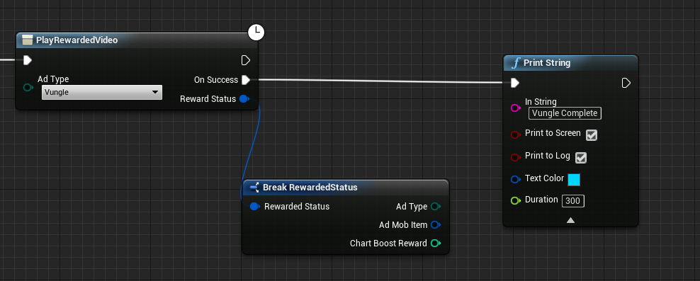
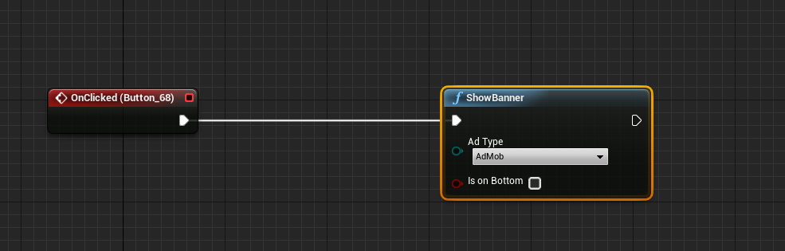
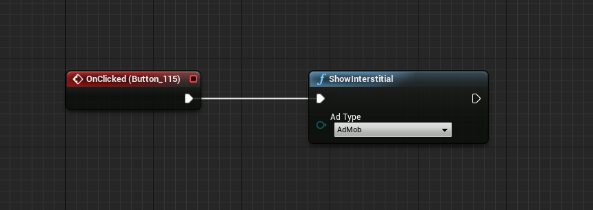
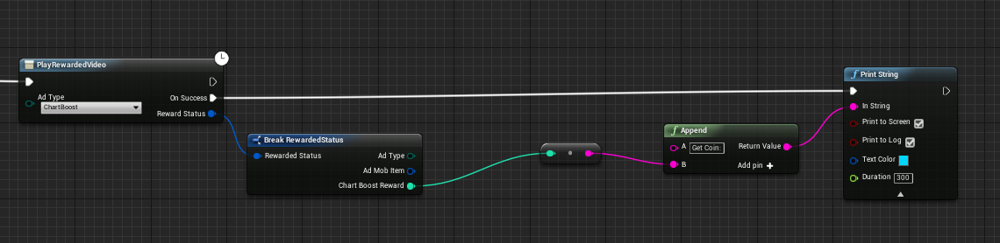
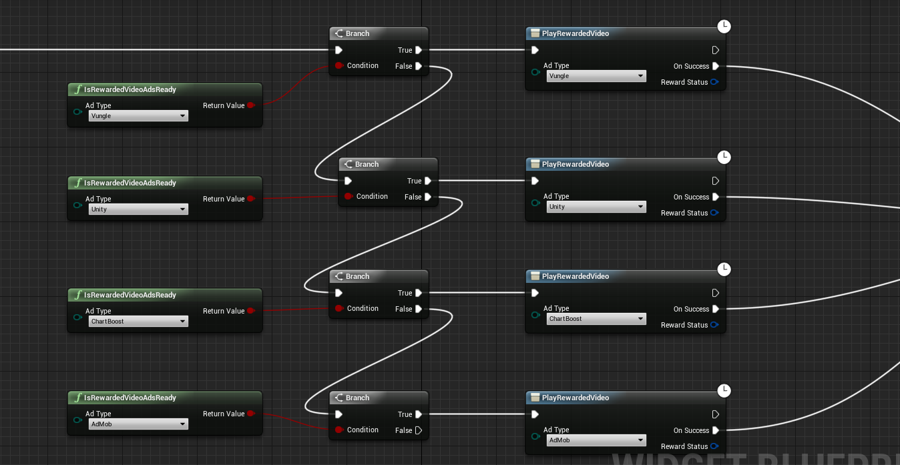

# UnrealEngine4-EZ-Mobile-Ads
One line code(or blueprint) Integrates Google AdMob mediation system and other ad networks for iOS &amp; Android.

All In One Mobile Ads help you easy integrates multiple ad networks for your game both Android and IOS same code, 
By use multiple ad networks, it will  help you maximize fill rate and increase monetization.
All features are available in C++ and Blueprint. this plugin automatic process ads reload and other detail, so
 you can easy use juse call when you need.

# FEATURES: 
★ 4 best game ad networks supported (more coming soon).

★  all ad  networks  can enable and disable in editor setting.

★  extremely easy  integrates just one line c++ code or blueprint for both IOS and Android. plugin automatic process ads reload
  and other detail.

★ support via e-mail

# PLATFORM SUPPORTED:
★ Android

★ IOS

# AD TYPES:
★ Banner

★ Interstitial (text, picture, video)

★ Reward Video

# SUPPORTED AD NETWORKS(more comming soon): 
★ AdMob

★ Vungle

★ ChartBoost

★ Unity

# Install

1、Copy Plugins folder to your project and compile the editor.

# Usage
  you can simply run the demo project for test, to integrates your own project, juse few steps:
  
1、Copy Plugins folder to your project and compile the editor.

2、Want Unity Ads? easy!!
      open project editor and find Unity Setting,  fill your application id for both Android and IOS.
      
      
3、In blueprint Editor, when you want show show the ads, just call function "PlayRewardedVideo",  setting the ad platform Unity . 
       you can add custom event to process after user complete watched the ads video.
	  

	  
# Other ShowCase
★ Want show Banner?

     

★ Want show interstitial?

     
	 
★ Want reward player with confiure coins from chartBoost?
     
    
	
	
★ Want maximize fill rate and increase monetization?

    
	
	
    
	   
